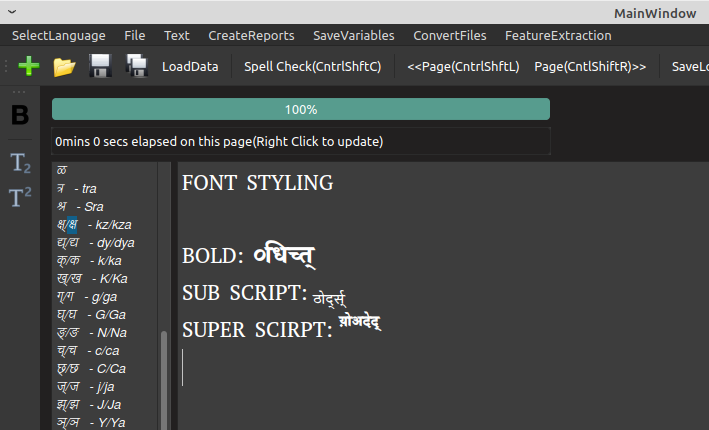

# Updated by Gokul Charade - BTech CSE

# OpenOCRCorrect
A framework for assisting human while correcting the OCR errors in documents, mostly dedicated to Indian Languages.
Tested on Sanskrit, Hindi, Marathi and English.

The interactive features as of now are:-
1. Error detection.
2. Generating Suggestions 

## Interface
- Added these features (Highlighted Areas)

## Added Features
- **BOLD** / UNBOLD
- SuperScript and SubScript

# Updated versions

https://www.cse.iitb.ac.in/~ocr/

# Video demo

https://www.youtube.com/watch?v=iYagbg-yKsc 
1. After laoding the OCR page, as user clicks on Spell Check, the correct words remain black.
2. The purple words are the auto corrections.
3. The incorrect words are colored with blue, green and red strings from Dictionary. This improves readability.
4. The user can type in slp1 format or right click on the word (right click suggestion may be a partially corrected word) to correct the words. "Ctrl+d" converts the slp1 word-under-cursor to Devanagari and removes the color coding from the word-under-cursor.
Right click works after clicking left on the word-under-cursor. Please mail to rohitsaluja22@gmail.com or file an issue for any suggestions to correct this.

# Ubuntu- Debian / Windows and Qt version

- Compiled and Tested on Linux Mint 20.2 with Qt 5
- Compiled and Tested on Windows 10 with Qt 5

# Installation

## Linux / Ubuntu- Debian

1. Add the Shobhika Font to Ubuntu from https://github.com/Sandhi-IITBombay/Shobhika/releases/ for reading Devanagari:
- Download latest version zip.
- Unzip the file.
- Open otf files with Font Viewer.
- Click Install on Top Right Corner.

2. Install qt5:
- $ sudo apt-get install qt5-default

3. Go to folder "FrameWorkCode", compile qpadfinal.pro and make:
- $ cd FrameWorkCode
- $ qmake qpadfinal.pro
- $ make
- Ignore the warnings. Will be removed in the next version.

## Windows

1. Add the Shobhika Font to Windows from https://github.com/Sandhi-IITBombay/Shobhika/releases/ for reading Devanagari:
- Download latest version zip.
- Unzip the file.
- Follow the instruction given there

2. Install qt5:

3. Open QTCreator
- Go to folder "FrameWorkCode", open qpadfinal.pro and build:
- Ignore the warnings. Will be removed in the next version.

# How to run the code?

## Linux / Ubuntu- Debian
Execute file qpadfinal in folder "FrameWorkCode"
- $ ./qpadfinal

## Windows
Click on the green icon - Run

# Creating Databse for Framework:

The folder “data/Book1Sanskrit” contains:-
1) A book named “Aryabhatiyabhashya of Nilakantha III Golapada (1957).pdf” for demo example.
2) “Dict” which is text file for Sanskrit Dictionary of 1.3 million words.
3) “IEROCR” text file that contains the OCR output of the book, each page separated by newline. ER represents English Removed, we ignore the words in english as Sanskrit ind-senz does not recognize English. Instead of ind-senz, output any OCR system can be used with the same filename.
4) “GEROCR” text file that contains the Google Doc output of the book, each page separated by newline. Instead of ind-senz, output any OCR system, other than one used in step 3 (above), can be used with the same filename.
5) SRules that contain 71 Sandhi Splitting Rules.
6) A text file with name "PWords" may be additionally added in folder "Book1Sanskrit" with Domain words, each separated by a newline, if known in advance.
7) A text file with name "CPair" may be additionally added in folder "Book1Sanskrit" with tab separated Correction pairs, one pair in one line, if known in advance. Prior OCR Confusions are also loaded from this file in additions to the autocorrections performed.
8) Folder “Inds” with jpeg files for first 20 pages of book and corresponding per page output from Indsenz.
9) Folder “Correct” with correct output of corresponding 20 pages in folder “Inds”.
10) Folder “Corrected” in which the output corrected by the user would be loaded while using the application.

# How to use the Framework

1) Select the Language out of Sanskrit, Hindi/Marathi or English from top right. Click on the “Open” icon on top left, or press “Ctrl+O”.
2) Open the file “data/Book1Sanskrit/Inds/page-1.txt”. This also link the files and folders in “Book1Sanskrit/”.
3) Click on “Load Data” to load Dictionary, Confusions, Sandhi Rules, GEROCR , IEROCR. Common OCR words in GEROCR and IEROCR will be loaded in Domain Vocabulary. It will take few seconds.
If you forget to “Load Data”, data will be loaded whenever you right click a word.
4) Finally, after loading data, page1.txt will again appear in the text browzer. Left click on the word to change the mouse cursor position and then right click on the colored words to generate suggestions.
5) Type in slp1 format and press “Cntrl+d” to change the text under cursor to Devanagari.
e.g. :-
प्रन्थाङ्कः -> graन्थाङ्कः -> (Cntrl D) -> ग्रन्थाङ्कः
If there are any issues in the format, just right click on the word and select the correct suggestion. Leave the correct colored words as it is.
6) Do not forget to use “Cntrl + S” to save the partially/fully corrected page to folder “Corrected”. Next time you come to the same page, the page will be uploaded from folder “Corrected” automatically.
7) Very Important: Afther the whole page is corrected load the words in Domainvocabulary by clicking “Cntrl + Shift + P”.
8) There is a timer on top left which gets updated on each right click or “Ctrl S”. It resets to 0 on loading the new page. Use “Ctrl+Shift+R” to move to next page and “Ctrl+Shift+L” to move to previous page.
9) As you use “Cntrl + Shift + P” to load domain words, you will observe improvement in suggestions page by page.
10) A useful tip: keep the GEROCR open in an editor as certain correct lines can be directly copied from it.

